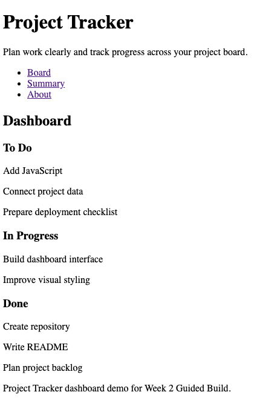
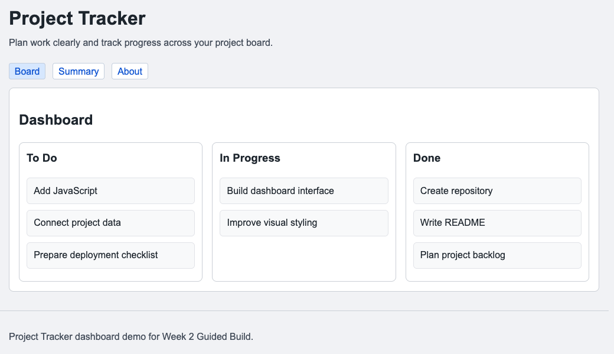
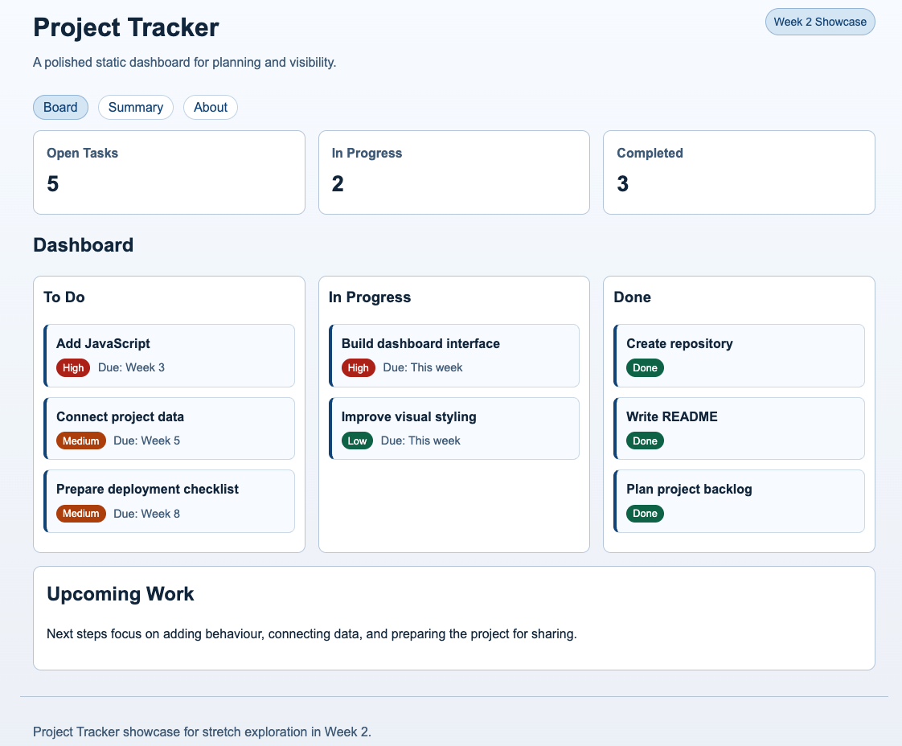

# Software Development Bootcamp

## Week 2

Creating the Interface

Dr Steve Huckle

<!--
Welcome learners back.

Recap that last week was about organising projects.

Today we start creating the first visible version of our applications.
-->

---

# Today's Goal

By the end of today you will have:

- Created your first web page
- Added styling with CSS
- Organised project files into folders
- Built a dashboard-style interface
- Created the first visible version of your project

<!--
Explain that today's focus is moving from planning to building.

Learners will leave with something they can see and show to others.
-->

---

<!-- _class: mentimeter-slide section-slide -->

# Last Week

## Mentimeter Activity

<!--
MENTIMETER

Question:
What foundations did we create last week?

Purpose:
Reconnect learners with Week 1.

Expected Responses:
- Repository
- README
- Backlog
- Project Board
- GitHub

Discussion:
Highlight that these foundations make today's work possible.
-->

---

# From Plan to Product

<div class="columns">
<div>

### Last Week

- Repository
- Project Board
- Backlog
- README

</div>
<div>

### This Week

- Interface
- Layout
- Navigation
- Styling

</div>
</div>

<!--
Explain that projects need both organisation and implementation.

Today we begin turning plans into products.
-->

---

<!-- _class: big-idea section-slide -->

# Big Idea

## Create something people can see and use

<!--
This is today's key message.

Return to it throughout the session.
-->

---

<!-- _class: mentimeter-slide section-slide -->

# What makes a website useful?

## Mentimeter Activity

<!--
MENTIMETER

Question:
What makes a website useful?

Purpose:
Introduce user-centred thinking.

Expected Responses:
- Easy to use
- Easy to understand
- Attractive
- Useful information
- Good navigation

Discussion:
Connect responses to user interfaces.
-->

---

# Why Do Applications Need Interfaces?

- Users need information
- Users need navigation
- Users need visual structure
- Users need feedback
- Users cannot use source code

<!--
Discuss examples learners use every day.

Focus on the user's perspective rather than technology.
-->

---

# Imagine This

A project with:

- Great ideas
- Useful features
- Excellent planning

But no interface

<!--
Ask learners:

Would anyone be able to use it?

Use this to reinforce why interfaces matter.
-->

---

# What Creates an Interface?

Two core technologies:

- HTML
- CSS

<!--
Introduce the technologies without diving into implementation yet.
-->

---

# HTML

## Structure

HTML describes:

- Headings
- Sections
- Navigation
- Content

<!--
Analogy:

HTML is the structure of a building.
-->

---

# CSS

## Presentation

CSS controls:

- Colours
- Layout
- Typography
- Spacing

<!--
Analogy:

CSS is the decoration and design of a building.
-->

---

# HTML + CSS

Structure + Presentation = User Interface

<!--
This relationship is the key takeaway from the lecture section.
-->

---

# Where Do We Use HTML and CSS?

- Websites
- Dashboards
- Portfolios
- Online Stores
- Web Applications

<!--
Highlight that these technologies are everywhere.
-->

---

# Project Structure Matters Too

```text
project-tracker/
├── index.html
└── styles/
    └── style.css
```

<!--
Connect back to Week 1.

Good software is organised.

Good project structure makes applications easier to maintain.
-->

---

# How Do Developers Create Interfaces?

<!--
Transition slide.

We are now moving from concepts to implementation.
-->

---

<!-- _class: reference-project section-slide -->

# Course Reference Project

## Project Tracker Dashboard

<!--
Introduce the morning Guided Build outcome.
-->

---

<!-- _class: reference-project section-slide -->

# Course Reference Project

## Today we will build

- Navigation
- Project Board
- Task Cards
- Styling
- Layout

<!--
Introduce the morning Guided Build outcome.
-->

---

<!-- _class: guided-build section-slide -->

# Guided Build

## Create the Project Structure

```text
project-tracker/
├── index.html
└── styles/
    └── style.css
```

<!--
Demonstrate file creation and organisation.
-->

---

<!-- _class: guided-build section-slide -->

# Guided Build

## Create the Application Structure

- Title
- Navigation
- Main Content
- Footer

<!--
Focus on structure before appearance.
-->

---

<!-- _class: guided-build section-slide -->

# Guided Build

## Create the Project Board

Columns:

- To Do
- In Progress
- Done

<!--
Discuss information organisation.

Users need structure.
-->

---

<!-- _class: guided-build section-slide -->

# Guided Build

## Add Task Cards

Example Tasks

- Create Repository
- Create README
- Build Interface
- Learn JavaScript
- Deploy Application

<!--
Discuss grouping information into reusable visual elements.
-->

---

<!-- _class: guided-build section-slide -->

# Guided Build

## Add CSS

Improve:

- Colours
- Typography
- Spacing
- Readability

<!--
Introduce styling gradually.

Show changes frequently.
-->

---

<!-- _class: guided-build section-slide -->

# Guided Build

## Create the Dashboard Layout

Transform the page into a simple application.

<!--
This is the "wow" moment.

Learners should see a dramatic improvement from plain HTML.
-->

---

# Before Styling

<!-- _class: image-slide -->



<!--
Show a screenshot or demonstration of the unstyled version.

Plain structure

Functional

Readable
-->

---

# After Styling

<!-- _class: image-slide -->



<!--
Show the completed dashboard.

Highlight the role of CSS.

Structured

Readable

Professional
-->

---

# Going Further - Showcase

<!-- _class: image-slide -->



<!--
Same application.

More polish.

More visual design.

More advanced layout.
-->

---

# Project Application

## Your Turn

Apply the same ideas to your own project.

Examples:

- Portfolio
- Recipe Collection
- Study Planner
- Habit Tracker

<!--
Learners adapt concepts rather than copy the dashboard.
-->

---

<!-- _class: stretch-activity section-slide -->

# Stretch Activities

## Finish Early?

Try:

- Additional Pages
- Better Styling
- More Dashboard Features
- Responsive Layouts
- Branding

<!--
Support assistant should help direct learners.
-->

---

<!-- _class: reflection section-slide -->

# Reflection

## What problem did we solve today?

<!--
Expected Discussion:

Users need an interface before they can benefit from software.

Connect answers back to the Big Idea.
-->

---

<!-- _class: mentimeter-slide section-slide -->

# Confidence Check

## Mentimeter Activity

<!--
MENTIMETER

Question:
How confident do you currently feel about HTML and CSS?

Purpose:
Measure confidence growth.

Expected Responses:
Confidence should generally be higher than at the start of the session.

Discussion:
Highlight progress made during the day.
-->

---

<!-- _class: mentimeter-slide section-slide -->

# Which part are you most proud of?

## Mentimeter Activity

<!--
MENTIMETER

Question:
Which part of your interface are you most proud of?

Purpose:
Encourage reflection and celebration of progress.

Expected Responses:
- Navigation
- Styling
- Layout
- Dashboard
- Personal project

Discussion:
Celebrate visible progress.
-->

---

<!-- _class: recap section-slide -->

# What Have We Learned Today?

- HTML provides structure
- CSS provides presentation
- Interfaces help users
- Projects benefit from organisation
- Design improves usability

<!--
Reconnect learning to the Big Idea.
-->

---

# Week 3

## Make the page do something

JavaScript

<!--
Preview next week.

Today we created an interface.

Next week we make it interactive.
-->

---

# Thank You

Questions?

Dr Steve Huckle

steve@huckle.studio

<!--
Thank learners.

Encourage them to continue refining their interfaces.
-->

<!-- EXPORT-IGNORE-START -->

---

# Mentimeter AI Import

<!--
Type: Word Cloud

Question:
What foundations did we create last week?

---

Type: Word Cloud

Question:
What makes a website useful?

---

Type: Scale

Question:
How confident do you currently feel about HTML and CSS?

Options:
- Very Unconfident
- Unconfident
- Neutral
- Confident
- Very Confident

---

Type: Word Cloud

Question:
Which part of your interface are you most proud of?

-->

<!-- EXPORT-IGNORE-END -->