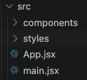
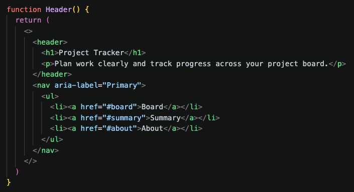
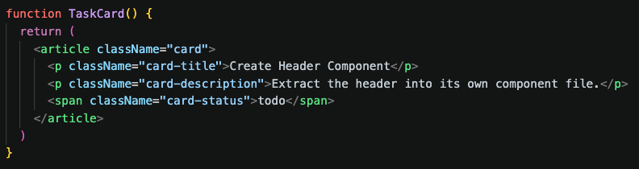
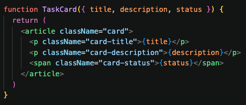
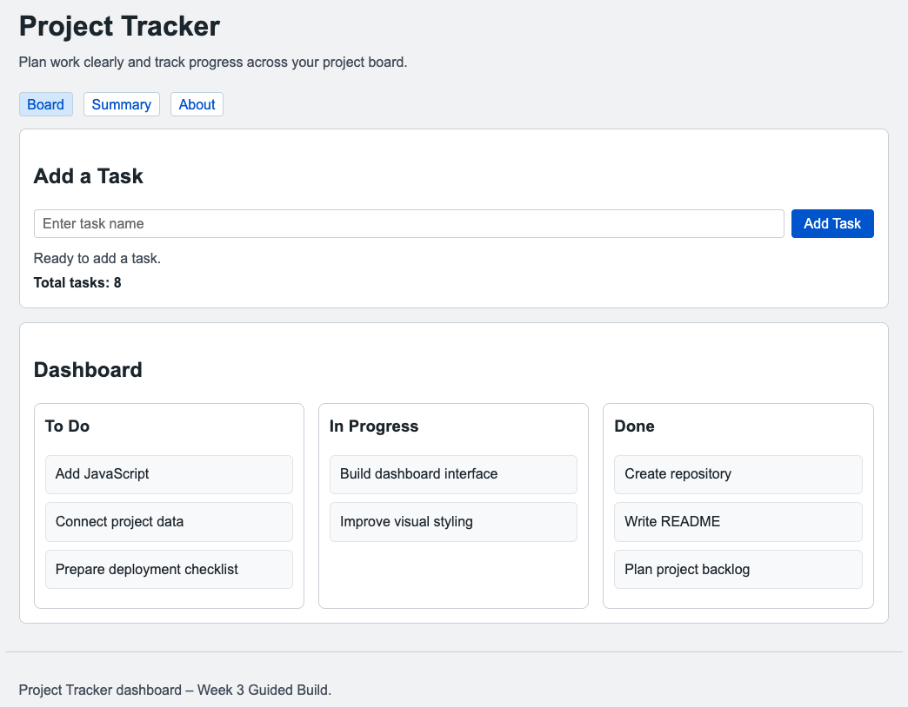
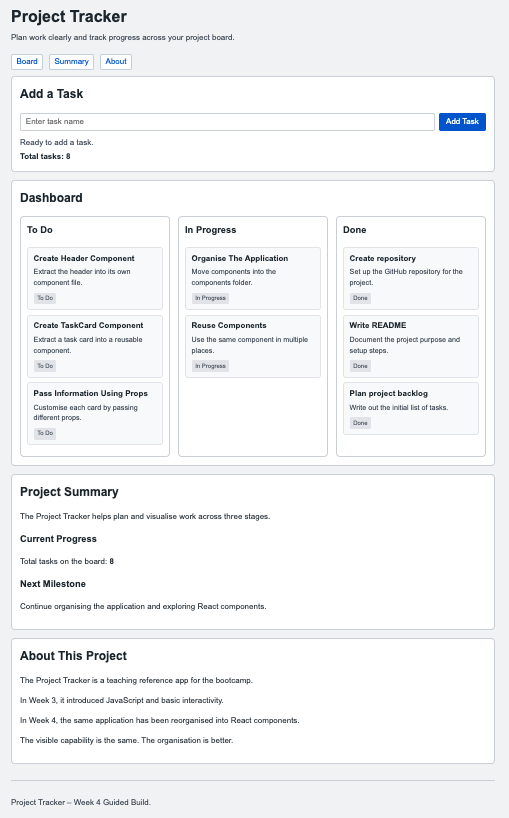
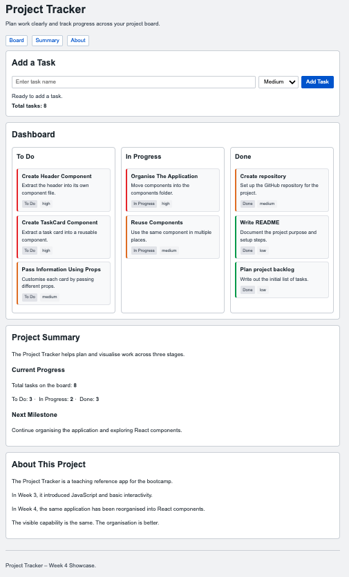

# Software Development Bootcamp

## Week 4

# Organising Larger Applications

Dr Steve Huckle

<!--
Welcome learners back.

Week 2 was about structure.

Week 3 was about behaviour.

Today is about organisation.

As software grows, we need better ways to organise it.
-->

---

# Today's Goal

By the end of today you will have:

- Explained why larger applications need organisation
- Created reusable components
- Used React to build components
- Passed information using props
- Applied component thinking to your own project

<!--
This week is not about memorising React.

It is about understanding why components are useful.

Success is recognising opportunities for reuse and organisation.
-->

---

<!-- _class: mentimeter-slide section-slide -->

# Previous Week Review

## Mentimeter Activity

<!--
Question:

What was the most useful thing you learned in Week 3?

Word Cloud

Discussion:

Learners may mention JavaScript, events, buttons, the DOM, inputs, creating tasks, or making pages interactive.

Use responses to reconnect with Week 3.

Week 3 taught us how to make pages respond to users.

Week 4 asks what happens when those interactive applications become larger.
-->

---

# Last Week

## HTML

Created structure

## CSS

Created presentation

## JavaScript

Created behaviour

<!--
Reinforce the three-part mental model from Week 3.

HTML gives the page structure.

CSS controls presentation.

JavaScript creates behaviour.
-->

---

# A Reminder

```text
HTML
What exists?

CSS
What does it look like?

JavaScript
What does it do?
```

<!--
Reinforce declarative versus procedural thinking without overloading learners with terminology.

HTML describes what should exist.

JavaScript describes what should happen.

The DOM allowed JavaScript to interact with page elements.
-->

---

# This Week

## Components

Create organisation

<!--
The problem has changed.

We can now build interfaces.

We can now add behaviour.

Now we need to keep larger applications understandable.
-->

---

<!-- _class: big-idea section-slide -->

# Big Idea

## As software grows, we need better ways to organise it

<!--
Return to this idea throughout the session.

Every React feature introduced today should be linked back to organisation.
-->

---

# Building Modern Web Applications

```text
HTML
    ↓
Structure

CSS
    ↓
Presentation

JavaScript
    ↓
Behaviour

Components
    ↓
Organisation
```

<!--
This extends the Week 3 model.

Do not present this as replacing previous learning.

Components build on what learners already know.
-->

---

# Our Applications Work

We can:

- Display information
- Respond to users
- Update the page
- Create new content

🎉

<!--
Celebrate progress.

Learners have already built something meaningful.

The next problem only appears because they are making progress.
-->

---

# But What Happens Next?

Imagine we add:

- More pages
- More features
- More users
- More code

<!--
Invite learners to imagine their own projects growing.

This prepares them for the need for organisation.
-->

---

<!-- _class: mentimeter-slide section-slide -->

# Mentimeter Activity

## What Happens When Software Gets Bigger?

<!--
Question:

What happens when software gets bigger?

Word Cloud

Expected responses:

Messy
Complicated
Harder
Confusing
Bugs
Maintenance
Slow
Difficult

Discussion:

Use the responses to establish the problem of complexity.

Larger software is not automatically bad, but it needs better organisation.
-->

---

# Imagine This

Your project now contains:

- Home page
- About page
- Summary page
- Navigation
- Dashboard
- Cards
- Lists

<!--
Ask:

Would you want everything in one file?

Would you want to copy and paste similar sections over and over again?

This is the moment to connect growth with organisation.
-->

---

<!-- _class: mentimeter-slide section-slide -->

# Mentimeter Activity

## Where Have You Seen Cards Online?

<!--
Question:

Where have you seen cards online?

Word Cloud

Expected responses:

Amazon
Netflix
Spotify
YouTube
LinkedIn
Instagram
News sites
Online stores

Discussion:

Cards are familiar interface patterns.

Many applications repeat similar interface elements many times.

This helps learners recognise components before the term is formally introduced.
-->

---

# A Common Pattern

```text
Task Card
Task Card
Task Card
Task Card
Task Card
```

<!--
Ask:

How many times have you copied and pasted similar HTML?

What happens if the design changes?

Do not mention React yet.

Stay focused on repetition and maintenance.
-->

---

# And Then...

```text
Task Card x 50
```

<!--
Push the example further.

Five repeated cards might feel manageable.

Fifty repeated cards makes the problem obvious.
-->

---

# Imagine This

What happens when:

- The design changes?
- A bug is discovered?
- A feature is added?

<!--
Encourage short discussion.

Expected answers:

We have to update lots of places.
We might miss one.
The design becomes inconsistent.
Bugs can appear repeatedly.
-->

---

<!-- _class: mentimeter-slide section-slide -->

# Mentimeter Activity

## Which Problem Sounds Most Annoying?

<!--
Question:

Which problem sounds most annoying?

Multiple Choice

Options:

A) Updating the same thing in 50 places
B) Fixing the same bug repeatedly
C) Keeping code organised
D) Understanding someone else's code

Discussion:

All answers are valid.

The purpose is to make the maintenance problem feel concrete.

Components are introduced as a response to these problems.
-->

---

# Why?

## Why Do We Need Components?

- Less duplication
- Easier maintenance
- Easier teamwork
- Better organisation

<!--
This is the Why section.

Components are not introduced because they are fashionable.

They are introduced because duplication and complexity create real development problems.
-->

---

<!-- _class: mentimeter-slide section-slide -->

# Mentimeter Activity

## Why Is Copying And Pasting Risky?

<!--

Question:

Why is copying and pasting risky?

Word Cloud

Expected Responses:

Mistakes

Bugs

Forgetting Changes

Inconsistency

Maintenance

Confusion

Discussion:

As software grows, repeated code becomes harder to maintain.

Developers look for ways to avoid repeating the same structure over and over again.

This creates a natural need for reusable components.
-->

---

# Software Grows

Complexity grows.

Organisation matters.

<!--
Pause here.

This is the key transition.

Learners should now understand the need for a new organisational approach.
-->

---

# The Goal

## Write Once

## Reuse Many Times

<!--
This is the bridge into components.

The class should already want a solution.

Do not introduce React yet.

The idea comes before the tool.
-->

---

# The Solution

Developers break large applications into smaller pieces.

Those pieces are called components.

---

# What?

## What Is A Component?

A component is a reusable piece of user interface.

<!--
Keep this definition simple.

A component has a job.

A component can be used again.

Avoid detailed React syntax at this stage.
-->

---

# Components Could Be

- Header
- Board
- Task Card
- Footer

<!--
Use examples from the reference application.

Then ask learners to think of examples from their own projects.
-->

---

# Thinking In Components

Instead of:

```text
One Giant Application
```

Think:

```text
Header
Board
Task Card
Footer
```

<!--
This is the core mental shift.

The goal is to break a large interface into smaller responsibilities.
-->

---

# When?

## When Do Developers Use Components?

- Dashboards
- Online stores
- Mobile apps
- Web applications
- Repeated interface patterns

<!--
Components are useful when an interface grows or when similar elements appear repeatedly.

Connect this back to the card examples.
-->

---

# React Is Not The Point

Problem:

Applications become larger.

Solution:

Components.

Tool:

React.

<!--
This is the most important slide of the day.

Learners may assume:

Week 2 = HTML
Week 3 = JavaScript
Week 4 = React

Correct this.

The progression is:

Structure
Behaviour
Organisation

React is simply a tool that helps us organise software.
-->

---

# Important

React does not replace JavaScript.

## React is JavaScript.

Everything from Week 3 still matters.

<!--
Reassure learners.

They have not wasted time learning JavaScript.

React builds on JavaScript.
-->

---

# How?

## How Do Developers Build Components?

React helps developers create reusable components.

<!--
Transition into the Guided Build.

The conceptual work is now in place.

The build demonstrates the idea in practice.
-->

---

<!-- _class: reference-project section-slide -->

# Course Reference Project

## Project Tracker Dashboard

<!--
The reference project continues.

Today the goal is not new functionality.

The goal is better organisation.
-->

---

# Today's Journey

```text
Week 3 Application
        ↓
React Project
        ↓
Header Component
        ↓
TaskCard Component
        ↓
AddTaskForm Component
        ↓
Props
        ↓
Preserve Existing Features
        ↓
Organised Application
```

<!--
Give learners the roadmap before coding.

Emphasise that each step is small.

Emphasise that the visible application will change very little.

The goal is better organisation, not new features.
-->

---

# Same Application

```text
Week 3 Application
        ↓
Same Features
        ↓
Better Organisation
```

<!--
The visible application changes very little.

The organisation changes significantly.

The goal this week is not to build a smaller application.

The goal is to reorganise the same application using components.
-->

---

<!-- _class: guided-build section-slide -->

# Guided Build

## Part 1

Explore the React Project Structure

- App.jsx
- main.jsx
- components/

<!--
Show the starter project.

Explain that learners do not need to understand every file.

Focus on where the application starts and where components live.

Can everyone find App.jsx?
Can everyone find the components folder?
-->

---

# Guided Build Screenshot



<!--
Insert screenshot of the React starter project structure.

This screenshot should show:

src/
  App.jsx
  main.jsx
  components/

Use this as a visual anchor before writing code.
-->

---

<!-- _class: guided-build section-slide -->

# Guided Build

## Part 2

Create a Header Component

- Create Header.jsx
- Return content
- Import component

<!--
First component should be deliberately simple.

The purpose is confidence.

Do not make this clever.

Emphasise:

A component is a function that returns interface.
-->

---

# Guided Build Screenshot



<!--
Insert screenshot of Header.jsx and App.jsx using Header.

Use the screenshot to reinforce:

Define component.
Import component.
Use component.

Can everyone:

- Create a component file?
- Import a component?
- Display a component?

Pause here before continuing.

This is a natural point for the support assistant to circulate.

Do not move on until most learners have seen the Header display correctly.
-->

---

<!-- _class: guided-build section-slide -->

# Guided Build

## Part 3

Create a TaskCard Component

- Create component
- Display task information
- Keep one clear responsibility

<!--
Connect this to the earlier repeated card example.

A TaskCard is a natural component because task cards repeat.
-->

---

# Guided Build Screenshot



<!--
Insert screenshot of TaskCard.jsx.

At this stage it can contain fixed text.

Props are introduced later.
-->

---

<!-- _class: guided-build section-slide -->

# Guided Build

## Part 4

Reuse TaskCard

- Add multiple TaskCards
- Avoid duplication
- Keep the structure consistent

<!--
Show the same component used more than once.

This is the first payoff.

Ask:

What have we avoided copying?
-->

---

# Pause And Think

What benefit have we gained already?

<!--
Expected answers:

Less repeated HTML.
More consistency.
One place to change structure.
Easier to read.
-->

---

<!-- _class: guided-build section-slide -->

# Guided Build

## Part 5

Add Props

- title
- description
- status

<!--
Props are inputs.

Avoid complex terminology.

Use the phrase:

One component.
Different information.

The TaskCard stays the same.

Only the data changes.
-->

---

# Guided Build Screenshot



<!--
Insert screenshot of TaskCard using props.

Show both:

function TaskCard(props)

or destructuring if used in the final app.

Keep syntax consistent with the reference app.

Ask:

> What stays the same?
>
> What changes?

Expected answer:

The component stays the same.

The information changes.

This checks whether learners understand props conceptually.
-->

---

<!-- _class: guided-build section-slide -->

# Guided Build

## Part 6

Create AddTaskForm Component

- Extract the Add Task form
- Pass onAddTask as a prop
- Preserve Week 3 capability

<!--
This step preserves the Add Task behaviour from Week 3.

The Week 3 application could add tasks.
The Week 4 application should also be able to add tasks.

React needs somewhere to remember the task list.
A small piece of state in App.jsx supports this.
State is not the focus of the week.

The focus is that the same capability is preserved through better organisation.
-->

---

<!-- _class: guided-build section-slide -->

# Guided Build

## Part 7

Organise the Application

- Components folder
- Clear responsibilities
- Easier maintenance

<!--
Show the final file structure.

Make the organisational improvement visible.

The application now has the same features as Week 3.

The code is now organised into reusable components.
-->

---

<!-- _class: guided-build section-slide -->

# Guided Build

## Part 8

Commit and Push

- Commit changes
- Push to GitHub

<!--
Reinforce professional development habits.

Suggested commit message:

Reorganise application into React components
-->

---

# Before Components



<!--
Insert screenshot of Week 3 Complete.

This shows the interactive application before component organisation.
-->

---

# After Components



<!--
Insert screenshot of Week 4 Complete.

The visible application may look similar.

The important change is internal organisation.
-->

---

# Going Further - Showcase



<!--
Insert screenshot of Week 4 Showcase.

Possible showcase additions:

Additional components.
Improved layout.
Richer project data.
Optional routing exploration.

Showcase remains optional.
-->

---

# Project Application

## Your Turn

1. Review your project
2. Identify repeated elements
3. Build components
4. Test
5. Commit & Push

<!--
The reference application is now complete.

Learners now apply the idea to their own projects.

The goal is one or two meaningful components, not a complete rebuild.
-->

---

# Start With A Plan

Before coding, identify one or two parts of your project that could become components.

Record your ideas in the worksheet.

<!--
Encourage learners to pause briefly before building.

The worksheet contains the planning activity.

Support assistants should help learners identify realistic component candidates.

The goal is one or two meaningful components, not a complete project redesign.
-->

---

# Possible Components

- Navigation
- Product Card
- Gallery Item
- Contact Section
- Testimonial Card
- Task Card
- Recipe Card
- Habit Summary

<!--
Offer examples without forcing learner projects to match the reference project.

Use these examples if learners are struggling to identify component opportunities.
-->

---

# Remember

The goal is not to copy the Project Tracker.

The goal is to organise your own project.

<!--
The reference project demonstrates component thinking.

Learners should apply the same thinking to their own projects.
-->

---

<!-- _class: stretch-activity section-slide -->

# Stretch Activities

## Finish Early?

Try:

- Additional components
- Better organisation
- Reusable layouts
- More props
- Explore React Router

<!--
Routing is stretch only.

Do not teach routing in the core guided build.

If learners explore it, frame it as navigation between views, not the main learning outcome.
-->

---

# Good Luck Organising Your Application!

<!--
At this point learners work independently.

The slide deck can remain here while tutors circulate.

Return to the deck for reflection.
-->

---

<!-- _class: reflection section-slide -->

# Reflection

## What Problem Did Components Solve Today?

<!--
Prompt:

What problem were components designed to solve?

Expected discussion:

As applications grow, repeated code and unclear structure become harder to manage.

Components help organise larger applications by reducing duplication and improving maintainability.

Encourage learners to answer in terms of organisation rather than React.
-->

---

<!-- _class: mentimeter-slide section-slide -->

# Mentimeter Activity

## Confidence Check

<!--
Question:

How confident do you currently feel about components and React?

Scale:

Very Unconfident
Unconfident
Neutral
Confident
Very Confident

Discussion:

Use this to identify who may need support before Week 5.

Remind learners that confidence comes from practice.

Today's goal was understanding organisation, not mastering React.
-->

---

<!-- _class: mentimeter-slide section-slide -->

# Mentimeter Activity

## What Component Are You Most Proud Of?

<!--
Question:

What component are you most proud of?

Word Cloud

Celebrate learner achievements.

Encourage learners to name their own project components, not reference project components only.

Use responses to reinforce the variety of projects being built.
-->

---

# What Have We Learned Today?

- Components improve organisation
- React helps us create components
- Components can be reused
- Props pass information
- Organisation matters as software grows

<!--
Summarise the session.

Reconnect to the Big Idea:

As software grows, we need better ways to organise it.

Components are one way developers solve that problem.
-->

---

# Looking Ahead

## Week 5

Working With Live Data

<!--
Next week applications begin working with information from outside the application.

Today we organised our code.

Next week we will connect our applications to external data.
-->

---

# Week 5 Big Idea

## Applications become more useful when they can work with external data

<!--
Preview APIs and JSON.

Do not introduce technical details yet.

Keep curiosity high.
-->

---

# Thank You

Questions?

Dr Steve Huckle

steve@huckle.studio

<!--
Thank learners.

Encourage them to continue improving and organising their projects.
-->

<!-- EXPORT-IGNORE-START -->

---

# Mentimeter AI Import

<!--
Type: Word Cloud

Question:
What was the most useful thing you learned in Week 3?

---

Type: Word Cloud

Question:
What happens when software gets bigger?

---

Type: Word Cloud

Question:
Where have you seen cards online?

---

Type: Multiple Choice

Question:
Which problem sounds most annoying?

Options:
- Updating the same thing in 50 places
- Fixing the same bug repeatedly
- Keeping code organised
- Understanding someone else's code

---

Type: Word Cloud

Question:
Why is copying and pasting risky?

---

Type: Scale

Question:
How confident do you currently feel about components and React?

Options:
- Very Unconfident
- Unconfident
- Neutral
- Confident
- Very Confident

---

Type: Word Cloud

Question:
What component are you most proud of?
-->

<!-- EXPORT-IGNORE-END -->
